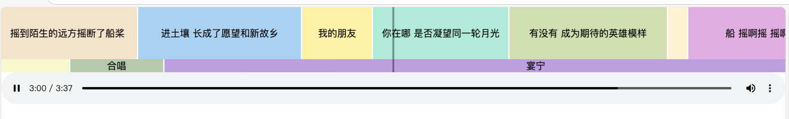
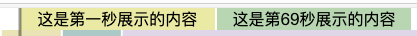

# react-timeline

一根时间线



## 安装

```bash
npm install react-av-timeline
```

## 使用

````jsx
<Component items={[{
        time:1,
        content:'这是第一秒展示的内容'
    },{
        time:69,
        content:'这是第69秒展示的内容'
    }]} 
    currentTime={0}
    scale={0.5} 
    totalTime={91} />
````

效果如图


# 应用

可以结合audio或video，通过监听timeupdate事件，实时更新currentTime，实现同步播放

如[example/App.tsx](example/App.tsx)或者[https://cnb.cool/arsrna/visualize-music](https://cnb.cool/arsrna/visualize-music)

# API

TODO