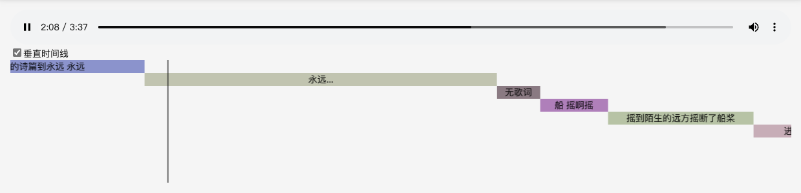

# react-timeline

一根时间线


## 安装

```bash
npm install react-av-timeline
```

## 使用

首先引入组件，由于css未注入，需要手动引入css

````jsx
import { Timeline } from 'react-av-timeline';
import 'react-av-timeline/dist/index.css';
````

````jsx
<Component items={[{
        time:1,
        content:'这是第一秒展示的内容',
        style:{
            background: "#EAEAAD"
        }
    },{
        time:69,
        content:'这是第69秒展示的内容'
    }]} 
    currentTime={0}
    scale={0.5} 
    totalTime={91} />
````

效果如图


## 垂直时间线
适合类似导播台自动化等序列化的场景，将时间线垂直展示



````jsx
// 注意，引入方式不一样，非default导出
import { Vertical } from 'react-av-timeline';
import 'react-av-timeline/dist/index.css'
````

基本参数与普通时间线一致，请参考[API](#API)

````jsx
<Vertical height={190} left={20} items={[{
        time:1,
        content:'这是第一秒展示的内容',
        style:{
            background: "#EAEAAD"
        }
    },{
        time:69,
        content:'这是第69秒展示的内容'
    }]} currentTime={currentTime} scale={10} totalTime={100} />
````

# 应用

可以结合audio或video，通过监听timeupdate事件，实时更新currentTime，实现同步播放

如[example/App.tsx](example/App.tsx)或者[https://cnb.cool/arsrna/visualize-music](https://cnb.cool/arsrna/visualize-music)

# API

## 通用

### 基本参数
````typescript
interface PropsType {
    /**时间轴 */
    items: itemsType[],
    /**时间轴样式 */
    itemStyle?: CSSProperties,
    /**当前时间点 */
    currentTime: number,
    /**总时长 */
    totalTime: number,
    /**缩放比例 */
    scale?: number,
    /**时间轴指示器属性 */
    indicator?: HTMLAttributes<HTMLDivElement>
}
````

### itemsType
````typescript
interface itemsType {
    /**时间点 */
    time: number,
    /**该点对应的样式 */
    style?: CSSProperties,
    /**该点对应的文字 */
    content?: ReactNode
}
````

## 垂直时间线
````typescript
PropsType & {
    /**保留前几个项目 */
    prev?: number
    /**距离左边距 */
    left?: number,
    /**总高度 */
    height?: CSSProperties['height']
}
````