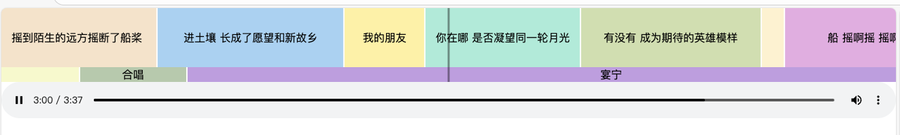
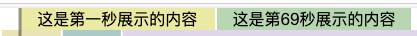
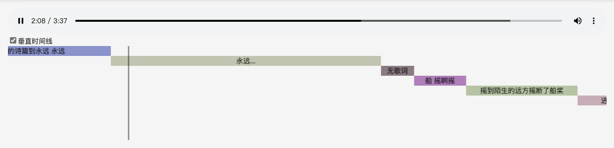

# react-timeline

一根时间线




# Breaking Changes

2.0以后，数据结构发生改变，需要重新更新代码

同时之后项目使用Vibe Coding，实现功能请参考`.trae/commands/code.md`

主要在时间轴数据结构上，以前的结构导致最后一个时间点的内容展示异常，所以现在加入了起始、结束时间点，时间是绝对的，也就是一个时间点内可以有多个轴共存。

## 安装

```bash
bun i react-av-timeline
# 或者npm i react-av-timeline
```

## demo
点击云原生开发后，运行`bun dev`

## 使用

首先引入组件，由于css未注入，需要手动引入css

````jsx
import { Timeline } from 'react-av-timeline';
import 'react-av-timeline/dist/index.css';
````

````jsx
<Component items={[{
        time:1,
        content:'这是第一秒展示的内容',
        style:{
            background: "#EAEAAD"
        }
    },{
        time:69,
        content:'这是第69秒展示的内容'
    }]} 
    currentTime={0}
    scale={0.5} 
    totalTime={91} />
````

效果如图



## 垂直时间线
适合类似导播台自动化等序列化的场景，将时间线垂直展示



````jsx
// 注意，引入方式不一样，非default导出
import { Vertical } from 'react-av-timeline';
import 'react-av-timeline/dist/index.css'
````

基本参数与普通时间线一致，请参考[API](#API)

````jsx
<Vertical height={190} left={20} items={[{
        time:1,
        content:'这是第一秒展示的内容',
        style:{
            background: "#EAEAAD"
        }
    },{
        time:69,
        content:'这是第69秒展示的内容'
    }]} currentTime={currentTime} scale={10} totalTime={100} />
````

# 应用

可以结合audio或video，通过监听timeupdate事件，实时更新currentTime，实现同步播放

如[example/App.tsx](example/App.tsx)或者[https://cnb.cool/arsrna/visualize-music](https://cnb.cool/arsrna/visualize-music)

# API

## 通用

### 基本参数
````typescript
interface PropsType {
    /**时间轴数据 */
    items: itemsType[],
    /**每个时间块的统一样式 */
    itemStyle?: CSSProperties,
    /**当前播放/指示的时间点 */
    currentTime: number,
    /**总时长（决定了时间轴的总长度基准） */
    totalTime: number,
    /**缩放比例（默认 1） */
    scale?: number,
    /**时间轴指示器（中线）的 HTML 属性 */
    indicator?: HTMLAttributes<HTMLDivElement>
}
````

### itemsType
````typescript
interface itemsType {
    /** 
     * 时间点定义：
     * - [start, end]: 明确的起止时间范围
     * - number: 仅起始时间，结束时间默认为下一个 item 的起始时间或 totalTime
     */
    time: [number, number] | number,
    /** 该时间块对应的自定义样式 */
    style?: CSSProperties,
    /** 该时间块对应的内容（ReactNode） */
    content?: ReactNode,
    /** 
     * 显示层级（仅水平时间轴有效）：
     * 指定该元素显示在第几行。如果不指定，系统将自动计算不重叠的最小层级。
     */
    level?: number
}
````

## 垂直时间线 (Vertical)
垂直时间线除了通用参数外，还支持以下扩展参数：
````typescript
{
    /** 距离左侧指示器的保留项目数：当时间轴过去后，保留前几个项目不消失 */
    prev?: number,
    /** 指示器（中线）距离左侧的百分比位置（默认 10） */
    left?: number,
    /** 时间轴容器的总高度 */
    height?: CSSProperties['height']
}
````

## 重叠规则 (Level)
- **水平模式**：当多个 items 时间重叠时，系统会自动将它们纵向排列。你可以通过 `level` 属性手动强制指定某个 item 所在的行数（Level 0 为最上方）。
- **垂直模式**：垂直时间轴**不受 `level` 影响**。它始终保持每行一个 item，并根据时间进度实现自动消失和后续元素的向上补位。